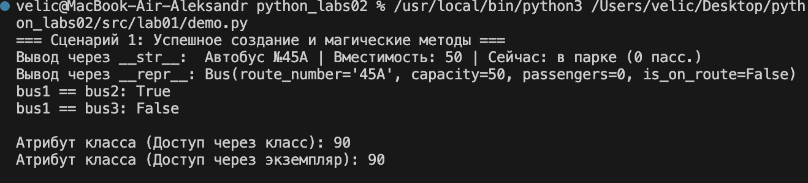
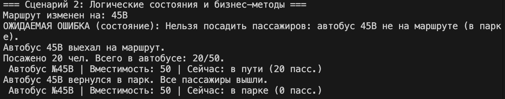
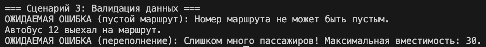
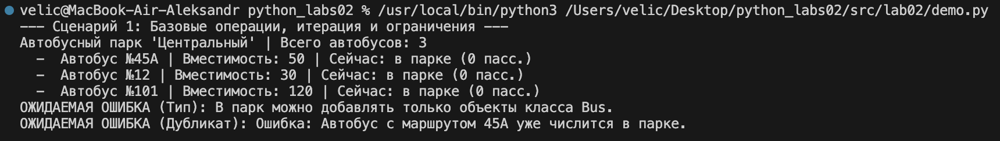
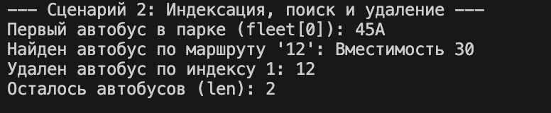
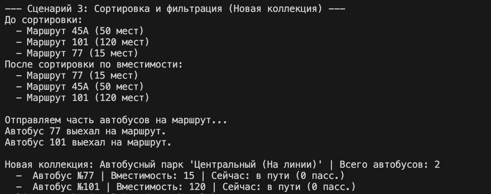
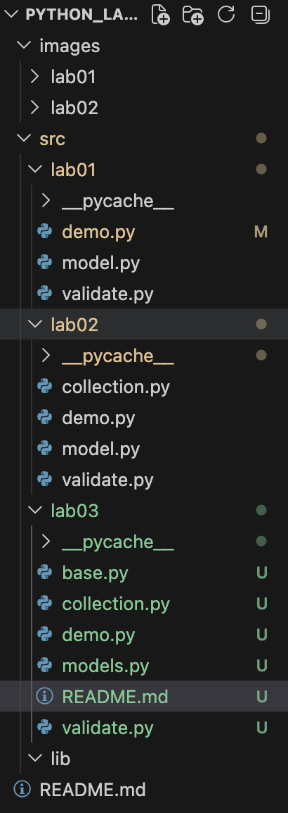
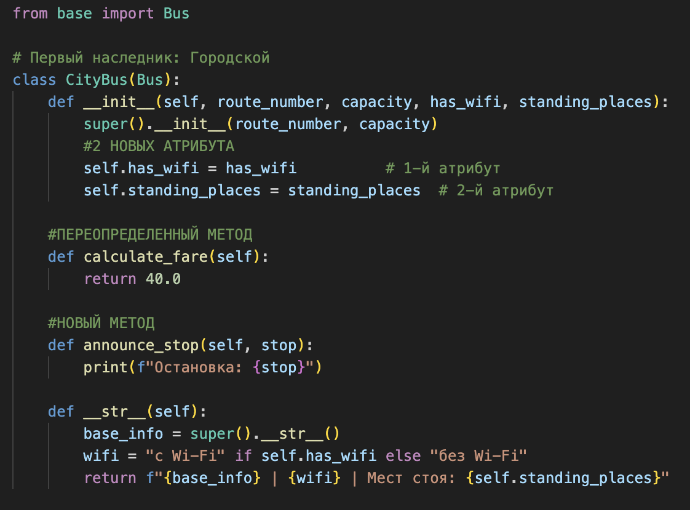
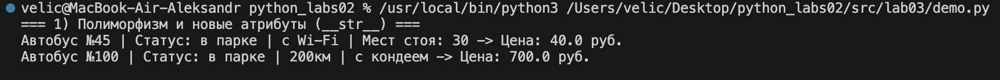
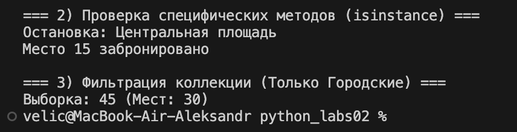

# Отчет по лабораторной работе №1: "Класс и инкапсуляция"

**Дисциплина:** Объектно-ориентированное программирование (Python)
**Выполнил:** [Величко А.Е.]
**Вариант:** 5. Транспорт (Сущность: `Bus`)

---

## 1. Мыслительный процесс при проектировании класса

* **Шаг 1. Выбор сущности и предметной области:** В рамках темы "Транспорт" я выбрал `Bus`. Эта сущность идеальна для демонстрации логических состояний: автобус может быть "на маршруте" или "в парке". От этого напрямую зависит, можно ли производить посадку пассажиров.
* **Шаг 2. Определение минимального набора атрибутов:** Чтобы выполнить требования (минимум 4 атрибута), я выделил:
    * `route_number` (номер маршрута) — строка.
    * `capacity` (вместимость) — целое число.
    * `passengers` (текущие пассажиры) — целое число.
    * `is_on_route` (состояние) — булево значение.
* **Шаг 3. Реализация инкапсуляции:** Чтобы защитить данные от некорректного вмешательства извне, все атрибуты были сделаны защищенными (`_attribute`). Доступ к ним я открыл через свойства `@property`.
* **Шаг 4. Вынесение валидации (Задание на 5):** Чтобы не загромождать конструктор и сеттеры логикой проверок и избежать дублирования кода, я вынес все проверки в отдельный файл `validate.py`.
* **Шаг 5. Определение поведения и состояний:** Автобус не просто хранит данные, он обладает поведением. Я добавил методы `start_route()` и `finish_route()`, которые меняют логическое состояние объекта. А метод `board_passengers()` теперь опирается на это состояние и не дает сажать людей, если автобус не выехал на маршрут.

---

## 2. Ответы на 5 вопросов с Практического занятия №1

### Вопрос 1. Что является сущностью?
**Ответ:** В предметной области "Транспорт" реально существует физический объект — **Рейсовый автобус**, который осуществляет перевозку пассажиров по городу. Именно его абстрактную модель (класс `Bus`) я и описываю. Это не просто "набор хотелок", а имитация реального транспортного средства.

### Вопрос 2. Какие у него атрибуты?
**Ответ:** Все выбранные атрибуты являются **характеристиками** объекта (отвечают на вопрос "какой?", "сколько?", "что делает в данный момент?"), а не действиями. Действия вынесены в методы класса.
* `_route_number` (номер маршрута) — характеристика (строка).
* `_capacity` (вместимость) — характеристика (целое число).
* `_passengers` (текущее число пассажиров) — характеристика (целое число).
* `_is_on_route` (находится ли на линии) — характеристика состояния (булево значение).

### Вопрос 3. Какие инварианты?
**Ответ:** Инвариант — это непреложное правило состояния объекта, которое никогда не должно нарушаться во время работы программы. В моем классе `Bus` инвариантами являются:
1. Номер маршрута не может быть пустой строкой.
2. Вместимость автобуса всегда строго больше нуля (`capacity > 0`).
3. Количество пассажиров не может быть отрицательным и не может превышать вместимость (`0 <= passengers <= capacity`).
4. Если автобус находится в парке (`_is_on_route == False`), количество пассажиров в нем обязано быть равным нулю.

### Вопрос 4. Что значит “равенство”?
**Ответ:** В реальном мире автобусы с одинаковым номером маршрута и одинаковой вместимостью могут быть разными физическими машинами. Но в рамках нашей бизнес-логики два объекта считаются равными (взаимозаменяемыми ресурсами на линии), если у них совпадают:
1. Номер маршрута.
2. Предельная вместимость.
При этом текущее количество людей внутри и то, едет ли он сейчас по городу, может отличаться. Именно такое поведение заложено в магический метод `__eq__`.

### Вопрос 5. Есть ли состояние?
**Ответ:** Да, у автобуса есть два логических состояния:
* **"На маршруте"** (`_is_on_route = True`).
* **"В парке"** (`_is_on_route = False`).

**Правила поведения, зависящие от состояния:**
1. Нельзя сажать пассажиров (вызывать метод `board_passengers()`), если автобус находится в состоянии "В парке".
2. При переходе в состояние "В парке" (метод `finish_route()`) автобус автоматически принудительно обнуляет количество пассажиров (все вышли на конечной).

---

## 3. Описание сценариев и скриншоты работы `demo.py`

Для подтверждения работоспособности всех систем в файле `demo.py` были заложены 3 основных сценария.

### Сценарий 1: Успешное создание и магические методы
Здесь демонстрируется создание валидных объектов, их сравнение через переопределенный оператор `__eq__` (сравниваются значения, а не ссылки в памяти), работа красивого вывода `__str__` и технического `__repr__`. Также показан доступ к общему атрибуту класса.
* **Ожидаемый результат:** Корректный вывод данных, `True` при сравнении одинаковых автобусов, вывод лимита скорости `90`.

### Сценарий 2: Логические состояния и бизнес-методы
Демонстрируется зависимость поведения от внутреннего состояния. Сначала мы пытаемся посадить людей в автобус, который находится в парке — система выдает ошибку. Затем отправляем автобус на маршрут, успешно сажаем людей и в конце сбрасываем состояние, возвращая его в парк.
* **Ожидаемый результат:** Перехват ошибки `RuntimeError`, успешная посадка после смены состояния, обнуление пассажиров при возврате в парк.

### Сценарий 3: Валидация данных
Демонстрируется работа вынесенной системы валидации. Мы пытаемся скормить системе некорректные данные: пустую строку вместо номера маршрута и количество пассажиров, превышающее физический лимит автобуса.
* **Ожидаемый результат:** Выброс и перехват исключений `ValueError` с понятным описанием ошибки.

# Отчет по лабораторной работе №2: "Коллекция объектов"

## 1. Разница между моделью сущности и контейнером объектов

В процессе выполнения работы было закреплено ключевое архитектурное отличие:
* **Модель сущности (`Bus`):** Отвечает исключительно за данные и поведение *одного конкретного объекта*. Автобус знает свою вместимость, свой маршрут и может сажать пассажиров. Он ничего не знает о существовании других автобусов.
* **Контейнер объектов (`BusFleet`):** Отвечает за *агрегацию и управление* множеством объектов. Автобусный парк не занимается посадкой людей, он занимается учетом: добавлением новых единиц техники, списанием (удалением), поиском нужного автобуса по номеру и фильтрацией.

## 2. Мыслительный процесс реализации коллекции

1. **Инкапсуляция хранилища:** В качестве внутренней структуры данных был выбран стандартный список `self._items = []`. Он скрыт внутри класса, чтобы внешние процессы не могли изменить его в обход правил (например, добавить объект неверного типа).
2. **Безопасность данных (Ограничения):** Переопределен метод `add()`. В него встроены две проверки:
   * *Проверка типа (`isinstance`):* Гарантирует, что в коллекцию попадут только объекты класса `Bus`.
   * *Бизнес-ограничение:* Реализована проверка на дубликаты. В рамках парка не может быть двух машин с одинаковым номером маршрута.
3. **Поддержка протоколов Python (Магические методы):** Чтобы класс `BusFleet` вел себя как встроенная коллекция Python, были реализованы:
   * `__iter__` — позволяет использовать контейнер в циклах `for bus in fleet`.
   * `__len__` — позволяет вызывать `len(fleet)` для получения количества объектов.
   * `__getitem__` — обеспечивает доступ к конкретному элементу по индексу: `fleet[0]`.
4. **Сортировка и Фильтрация:** Реализован метод `sort_by_capacity()`, использующий `lambda`-функцию для сортировки внутреннего списка. Метод `get_active_fleet()` демонстрирует логическую операцию над коллекцией: он не меняет текущий объект, а конструирует и возвращает **новый** объект класса `BusFleet`, содержащий только те автобусы, у которых флаг `_is_on_route` установлен в `True`.

---

## 3. Скриншоты работы `demo.py`

### Сценарий 1: Базовые операции, итерация и ограничения
Демонстрируется успешное добавление объектов, перебор через цикл `for` (благодаря `__iter__`), а также корректное срабатывание системы защиты: перехват исключений при попытке добавить строку вместо объекта и при попытке добавить дубликат существующего маршрута.

### Сценарий 2: Индексация, поиск и удаление
Демонстрируется обращение к элементу коллекции по индексу (благодаря `__getitem__`), успешный поиск автобуса по номеру маршрута и удаление элемента по индексу.

### Сценарий 3: Сортировка и фильтрация
Показано изменение порядка элементов в коллекции после применения метода `sort_by_capacity()`. Затем часть автобусов отправляется на маршрут, и вызывается метод `get_active_fleet()`, который успешно формирует и возвращает новую независимую коллекцию только с активными машинами.

# Лабораторная работа №3: Иерархия классов и полиморфизм

## Введение и ход мышления
При переходе от второй лабораторной работы к третьей основной задачей стало развитие архитектуры проекта. Если раньше мы работали с «универсальным» автобусом, то теперь возникла необходимость специализации транспорта под разные задачи (городские и междугородние перевозки).

**Моя логика проектирования:**
1.  **Выделение фундамента:** Я вынес все общие свойства (номер, вместимость, статус) в базовый класс `Bus`. Это позволяет не дублировать код валидации и свойств в каждом новом классе.
2.  **Наследование:** Созданы два дочерних класса. Они «наследуют» всё от родителя, но расширяют его своими уникальными характеристиками (например, наличие Wi-Fi для города или дистанция для межгорода).
3.  **Полиморфизм:** Это ключевой этап. Вместо того чтобы писать сложные проверки `if тип == "городской"`, я внедрил единый метод `calculate_fare()`. Каждый класс сам «знает», как считать свою цену, а основная программа просто вызывает этот метод.
4.  **Безопасность типов:** Для корректной работы коллекции в рамках новой иерархии все компоненты были объединены в один пакет, что гарантирует правильную работу оператора `isinstance`.

---

## Архитектура системы

### 1. Базовый класс (Base)
Содержит «генетический код» проекта: инкапсулированные данные, защищенные свойствами, и общие магические методы (`__str__`, `__eq__`). Здесь же определен интерфейс для расчета стоимости.

### 2. Дочерние классы (Models)
* **CityBus:** Ориентирован на массовые перевозки. Включает учет стоячих мест и специфические действия (объявление остановок).
* **IntercityBus:** Ориентирован на комфорт и дистанцию. Включает расчет цены по километражу и функционал бронирования мест.

### 3. Демонстрационный сценарий
Программа имитирует работу реального автопарка, выполняя три сценария:
* Массовая обработка объектов через полиморфные вызовы.
* Адресная работа с объектами после проверки их типа.
* Выборка (фильтрация) специфического транспорта из общей массы.

---

## Скриншоты и отчетность

### Скриншот №1: Структура проекта

*Рисунок 1 — Структура автономного пакета лабораторной работы №3.*

### Скриншот №2: Реализация наследования

*Рисунок 2 — Пример расширения базового класса и использование конструктора родителя.*

### Скриншот №3: Результат работы (Полиморфизм)

*Рисунок 3 — Демонстрация полиморфного поведения метода расчета стоимости.*

### Скриншот №4: Выборка и специфические методы

*Рисунок 4 — Работа с уникальными методами классов после фильтрации коллекции по типу.*
