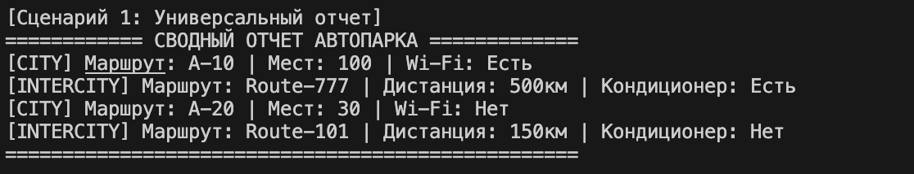
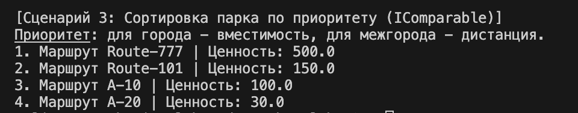

# Лабораторная работа №4: Интерфейсы и абстрактные классы (ABC)

## 1. Цель работы
Основная цель работы - переход от простого наследования к проектированию систем через **контракты поведения**. 
В ходе работы изучались:
* **Абстрактные базовые классы (ABC):** создание классов-шаблонов, от которых нельзя создать экземпляры.
* **Интерфейсы:** определение обязательных методов, которые дочерние классы «обязуются» реализовать.
* **Множественная реализация:** наделение одного класса несколькими независимыми умениями (контрактами).

---

## 2. Описание интерфейсов
В проекте выделено два независимых интерфейса, которые задают стандарты поведения для транспортных единиц:

1.  **`IPrintable`**:
    * **Метод:** `get_detailed_info()`
    * **Назначение:** Обязывает объект возвращать полную строковую информацию о себе в формате, пригодном для генерации сводных отчетов.
2.  **`IComparable`**:
    * **Метод:** `get_comparison_value()`
    * **Назначение:** Обязывает объект возвращать числовое значение (`float`), которое отражает его «ценность» или «приоритет» для системы. Это позволяет сравнивать и сортировать объекты разных типов.

---

## 3. Реализация в классах
Интерфейсы реализованы в базовом абстрактном классе `Bus`, что делает всех его наследников участниками системы контрактов.

* **Класс `CityBus` (Городской автобус):**
    * **Реализация `IPrintable`:** Выводит данные о Wi-Fi и стоячих местах.
    * **Реализация `IComparable`:** В качестве «ценности» возвращает свою **вместимость**. Чем больше людей помещается в автобус, тем он приоритетнее для городских маршрутов.
* **Класс `IntercityBus` (Междугородний автобус):**
    * **Реализация `IPrintable`:** Выводит данные о дистанции рейса и наличии кондиционера.
    * **Реализация `IComparable`:** В качестве «ценности» возвращает **дистанцию маршрута**. Для межгорода приоритет определяется дальностью рейса, а не количеством мест.

---

## 4. Демонстрация (demo.py)

Работа программы разделена на три ключевых сценария, демонстрирующих мощь интерфейсного подхода:

### Сценарий №1: Универсальный отчет (Полиморфизм)
Использование интерфейса как типа данных. Функция `generate_global_report` принимает список объектов типа `IPrintable` и выводит их данные, не зная, к каким конкретно классам они относятся.

**Скриншот работы сценария 1:**

### Сценарий №2: Проверка реализации контрактов
Демонстрация множественной реализации через проверку `isinstance`. Мы подтверждаем, что объект одновременно является и «печатным», и «сравниваемым».

**Скриншот работы сценария 2:**

### Сценарий №3: Архитектурное поведение (Сортировка)
Коллекция `BusFleet` выполняет фильтрацию и сортировку объектов, опираясь исключительно на интерфейс `IComparable`. Это позволяет в одном списке ранжировать разные типы автобусов по их уникальным критериям (километры vs люди).

**Скриншот работы сценария 3:**

---

## Выводы
Использование абстрактных классов и интерфейсов позволило сделать архитектуру автопарка более гибкой. Теперь система может работать с любым новым типом транспорта (например, «Грузовик» или «Такси»), если они реализуют соответствующие интерфейсы, без изменения логики в `demo.py` или `collection.py`.