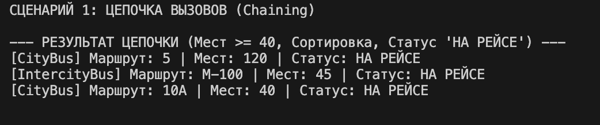
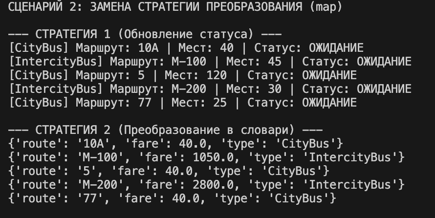

# Лабораторная работа №5. Функции как аргументы. Стратегии и делегаты.

## 1. Цель работы
Изучение функциональных возможностей языка Python применительно к объектно-ориентированному коду. Основные задачи включают:
* Освоение передачи функций как объектов первого класса.
* Применение функций высшего порядка: map, filter, sorted.
* Реализация паттерна проектирования «Стратегия».
* Использование lambda-выражений и замыканий (фабрик функций).
* Реализация цепочек вызовов (method chaining) для обработки коллекций.

## 2. Реализованные функции и стратегии

### Стратегии сортировки
В модуле `strategies.py` реализованы следующие именованные функции для использования в качестве ключей сортировки:
* `sort_by_route` — сортировка по номеру маршрута (строковый тип).
* `sort_by_capacity` — сортировка по количеству мест (числовой тип).
* `sort_by_fare` — сортировка по стоимости проезда, использующая полиморфный метод `calculate_fare()` из ЛР-3.

### Функции фильтрации и фабрики
Реализована фабрика функций `make_capacity_filter(min_capacity)`, которая возвращает замыкание. Это позволяет динамически создавать фильтры с различными пороговыми значениями вместимости без дублирования кода.

### Функции преобразования (map)
Реализованы механизмы трансформации объектов:
* Изменение внутреннего состояния (статуса) автобусов.
* Преобразование объектов классов `CityBus` и `IntercityBus` в формат словарей (dict) для последующей сериализации.

### Паттерн Стратегия и callable-объекты
Реализован класс `StatusUpdateStrategy` с методом `__call__`. Это позволяет использовать экземпляр класса в качестве функции, что демонстрирует концепцию callable-объектов в Python.

### Методы коллекции
Класс `BusFleet` расширен методами:
* `sort_by(key_func)` — обертка над встроенным методом `sort`.
* `filter_by(predicate)` — возвращает новый экземпляр коллекции, содержащий отфильтрованные элементы.
* `apply(func)` — применяет заданную операцию к каждому элементу коллекции.

## 3. Демонстрация работы

### Сценарий 1: Цепочка операций
Продемонстрирована последовательная обработка данных. Коллекция фильтруется по минимальной вместимости, затем сортируется по убыванию и в конце ко всем объектам применяется функция изменения статуса. Весь процесс реализован через единую цепочку вызовов.

### Сценарий 2: Замена стратегий
Показана работа коллекции с различными типами функций. В первом случае передается функция, модифицирующая атрибуты, во втором — трансформирующая объекты в словари. Это подтверждает, что логика обработки отделена от логики хранения данных.

### Сценарий 3: Использование callable-объекта
Демонстрация передачи экземпляра класса `StatusUpdateStrategy` в метод коллекции. Объект успешно вызывается для изменения статуса конкретного автобуса.

## 4. Вывод
В ходе выполнения лабораторной работы была реализована интеграция функционального и объектно-ориентированного подходов. Использование функций как аргументов позволило сделать класс коллекции универсальным: теперь он не содержит жестко прописанных алгоритмов сортировки или фильтрации, а получает их извне. Применение паттерна «Стратегия» и цепочек вызовов существенно повысило читаемость кода и гибкость архитектуры системы, созданной в рамках ЛР 1-3.