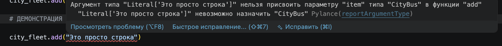
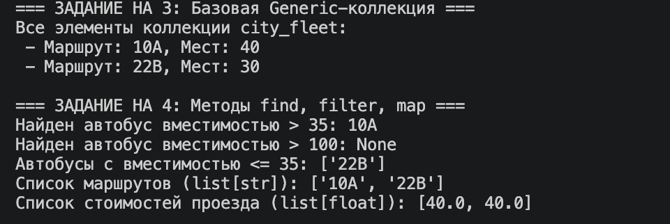
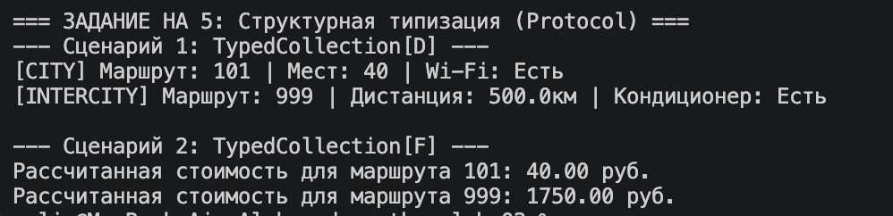

# Лабораторная работа №6: Generics и typing

## 1. Цель работы
Освоить систему аннотаций типов в Python (модуль `typing`). Научиться создавать обобщенные (generic) классы, ограничивать типы с помощью `TypeVar` и применять концепцию структурной типизации через `typing.Protocol`.

## 2. Описание реализованных типов и контейнеров

В ходе выполнения работы были типизированы классы автобусного парка из ЛР-1 и реализованы следующие структуры:

*   **`TypedCollection[T]`**: Обобщенный класс коллекции. Наследуется от `Generic[T]`. Позволяет создать безопасный контейнер, который жестко контролирует тип добавляемых элементов (например, только `CityBus`).
*   **Методы высшего порядка (`find`, `filter`, `map`)**: Добавлены в `TypedCollection` с полными аннотациями функций через `Callable`. Метод `map` использует дополнительный `TypeVar('R')`, что позволяет менять тип возвращаемой коллекции (например, превратить коллекцию автобусов в список чисел — стоимостей проезда).
*   **Протоколы (Protocol)**: 
    *   `Displayable` — требует наличия метода `display() -> str`.
    *   `FareCalculable` — требует наличия метода `calculate_fare() -> float`.
*   **Ограничения типов (Bounds)**: Созданы специальные переменные типов `D = TypeVar('D', bound=Displayable)` и `F = TypeVar('F', bound=FareCalculable)`. Они позволяют `TypedCollection` принимать любые объекты разных классов без явного наследования, при условии, что у них реализованы методы из нужного протокола.

## 3. Демонстрация работы

### Сценарий 1: Валидация типов
При попытке добавить в коллекцию `TypedCollection[CityBus]` объект типа `str`, среда разработки (IDE) выдает предупреждение о несоответствии типов.

### Сценарий 2: Базовая работа и методы высшего порядка
Демонстрация добавления элементов и работы методов `find`, `filter`, и `map`. Метод `map` успешно конвертирует типизированную коллекцию объектов в список строк (номера маршрутов) и список чисел (базовые тарифы).

### Сценарий 3: Структурная типизация (Protocol)
Демонстрация работы с коллекциями `TypedCollection[D]` и `TypedCollection[F]`. В коллекцию успешно добавляются объекты разных классов (`CityBus` и `IntercityBus`), так как они оба структурно соответствуют требованиям протоколов `Displayable` и `FareCalculable` (имеют нужные методы). IDE корректно распознает эти методы.
!

## 4. Вывод
В результате выполнения лабораторной работы было изучено:
1.  **Аннотации типов**: Помогают избежать критических ошибок еще до запуска кода, делая его самодокументируемым.
2.  **Generic и TypeVar**: Позволяют создавать универсальные контейнеры и функции, сохраняя при этом строгий контроль типов.
3.  **Protocol**: Демонстрирует мощь "утиной типизации" Python в статическом виде. Позволяет описывать интерфейсы без необходимости создавать сложные иерархии наследования.