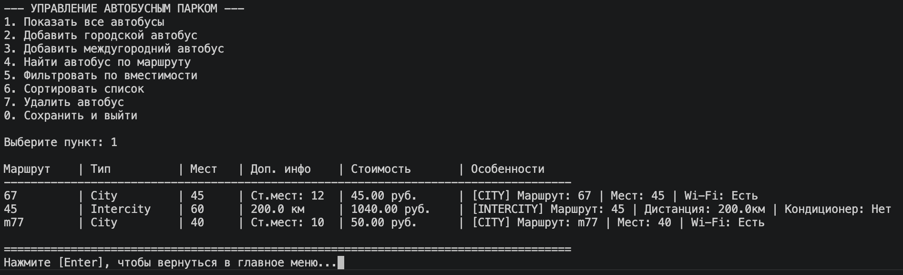
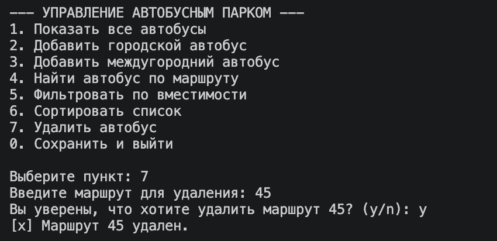
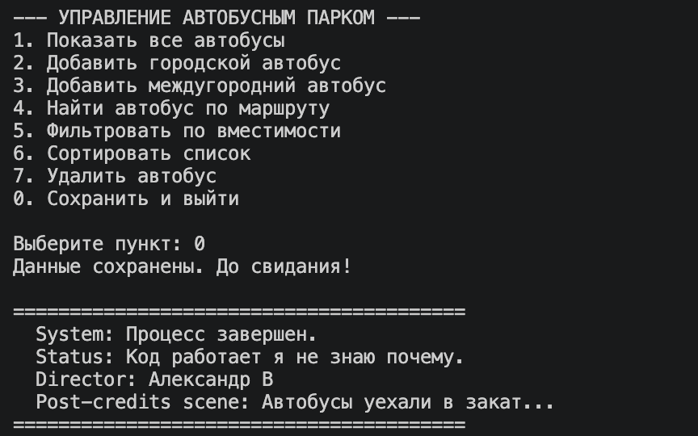
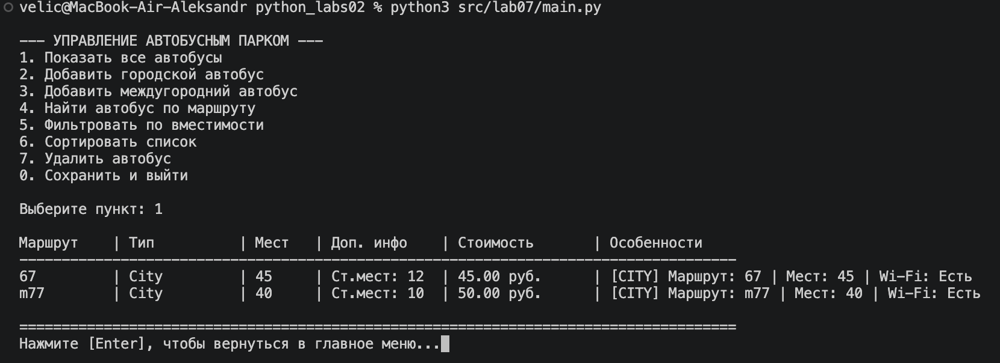
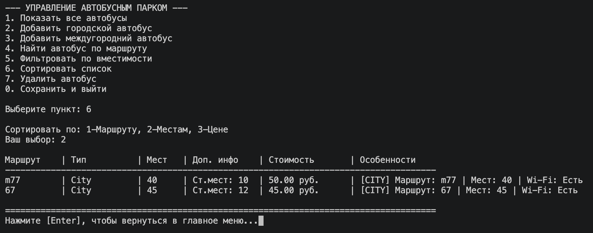
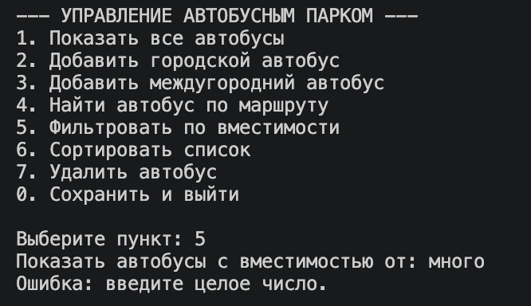
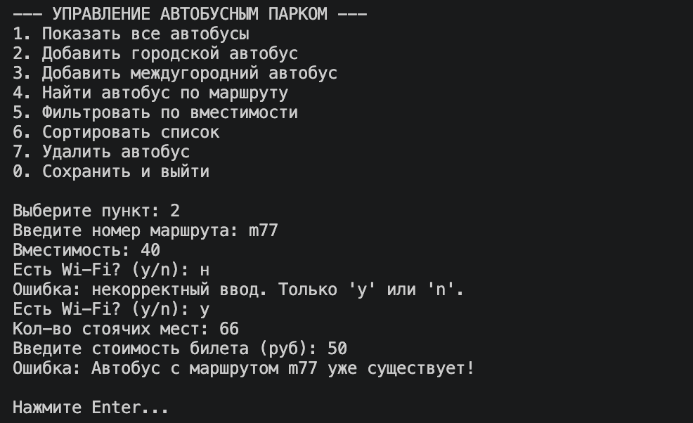

# Лабораторная работа: Система управления автопарком (Bus Management System)

Консольное приложение на языке Python, реализующее интерактивный CLI для управления коллекцией автобусов. Проект разработан с использованием объектно-ориентированного программирования (ООП) и многослойной архитектуры (Layered Architecture).

## 1. Архитектура проекта

Приложение разделено на независимые слои, что обеспечивает слабую связанность кода и упрощает его поддержку:
*   **`main.py`** — Точка входа в приложение, запускает основной цикл программы.
*   **`models.py`** — Слой бизнес-моделей. Содержит базовый класс автобуса и дочерние классы (городские и междугородние автобусы) с полиморфным расчетом стоимости билетов.
*   **`storage.py`** — Слой сохранения данных. Отвечает за автоматическую загрузку и сериализацию/десериализацию коллекции в формат JSON.
*   **`app.py`** — Слой бизнес-логики. Управляет коллекцией автобусов, реализует фильтрацию и динамическую сортировку с использованием паттерна «Стратегия».
*   **`cli.py`** — Слой представления. Отвечает за вывод интерактивного меню в консоль и строгую валидацию пользовательского ввода.
*   **`exceptions.py`** — Слой кастомных исключений. Содержит ошибки предметной области (например, DuplicateItemError), что позволяет отделять системные ошибки от логических

---

## 2. Описание CLI

Приложение работает в интерактивном режиме. Основные функции меню:
1.  **Просмотр:** Вывод всей коллекции в виде отформатированной таблицы.
2.  **Управление:** Добавление новых автобусов и удаление существующих с подтверждением (y/n).
3.  **Поиск и фильтрация:** Поиск по номеру маршрута и фильтрация по типу автобуса.
4.  **Сортировка:** Динамическая сортировка по местам или маршруту (Strategy pattern).

**Обработка ошибок:** Система перехватывает некорректный ввод (строки вместо чисел) и логические ошибки (дубликаты), сохраняя работоспособность приложения.
**Сохранение данных:** Загрузка происходит автоматически при старте из `buses.json`, сохранение — при выборе пункта «Выход».

---

## 3. Инструкция по запуску


```bash
# Перейдите в папку проекта
cd python_labs02/src/lab07

# Запустите главный файл
python main.py

```

---

## 4. Демонстрация работы (Сценарии)

### Сценарий 1: Запуск и автозагрузка данных из файла

При старте приложения слой `Storage` автоматически считывает текущую базу данных из файла `buses.json`. При выборе пункта меню "Показать все" на экран выводится актуальная таблица с данными.




### Сценарий 2: Модификация данных с подтверждением и сохранение

В системе реализовано удаление автобуса по номеру маршрута с обязательным подтверждением действия со стороны пользователя (запрос `y/n`). При выходе из программы (`0`) данные автоматически перезаписываются в файл `buses.json`. При повторном запуске удаленный элемент отсутствует.






### Сценарий 3: Сортировка с выбором стратегии через меню

Программа поддерживает динамическую сортировку коллекции. Пользователь через меню может выбрать критерий сортировки (например, по количеству мест или по номеру маршрута). После выбора таблица выводится в упорядоченном виде.




### Сценарий 4: Фильтрация данных и перехват исключений

В приложении настроена жесткая обработка ошибок пользовательского ввода (перехват `ValueError`) и кастомных бизнес-исключений (например, `DuplicateItemError` при попытке добавить уже существующий маршрут). Программа не завершается аварийно, а выводит понятное предупреждение.






---

## 5. Дополнительное задание (Запись CLI)

Интерактивная запись работы интерфейса в реальном времени со всеми выполненными сценариями опубликована на сервисе `asciinema`:


[](https://asciinema.org/a/j75W7XKCBx0DZuiB)

---

## 6. Вывод

В ходе выполнения лабораторной работы были закреплены навыки разделения приложения на независимые слои (UI, Business Logic, Storage). Реализован полноценный CLI-интерфейс с валидацией данных. Изучена работа с JSON-сериализацией, применение паттернов проектирования и использование строгой типизации в Python.